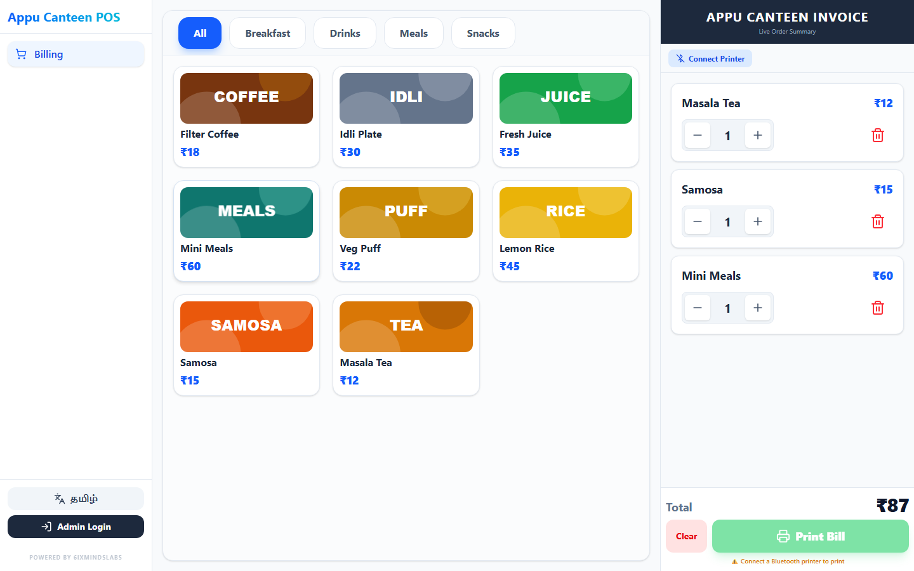
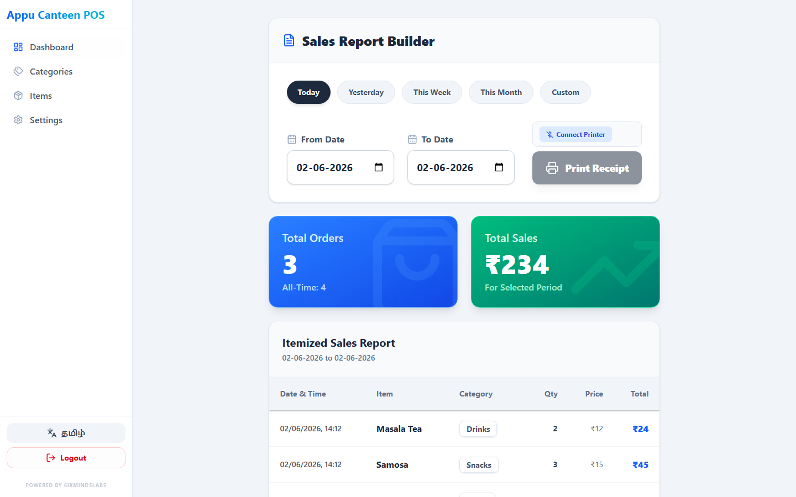
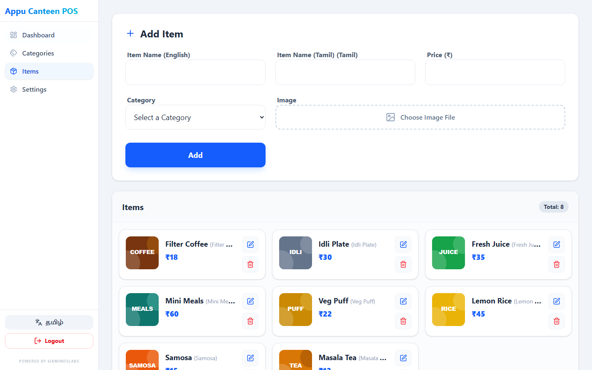
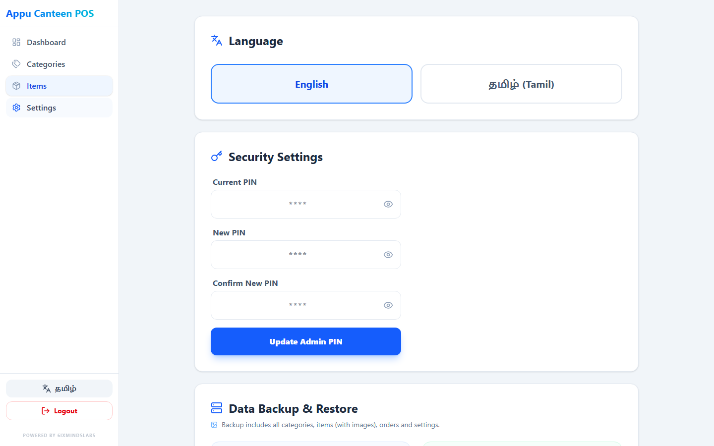
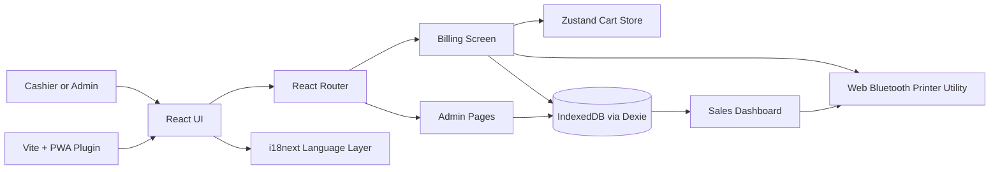

# Canteen Billing System

Appu Canteen POS is an offline-friendly canteen billing system built for fast counter sales, menu management, sales reporting, and Bluetooth thermal receipt printing.

**Live deployment:** https://canteen-billing-system.vercel.app/

## Screenshots

### Billing Screen



### Sales Dashboard



### Items Management



### Settings



## Features

- Fast POS billing screen with category filters, item cards, cart quantity controls, and bill total.
- Admin-only management for categories and items.
- Item image upload support, stored locally with the item data.
- Sales dashboard with Today, Yesterday, This Week, This Month, and Custom date filters.
- Itemized sales report with totals, order count, categories, quantities, and prices.
- Web Bluetooth thermal printer support for common 58mm ESC/POS printers.
- Sales report printing through the same Bluetooth printer utility.
- Offline-first local storage using IndexedDB through Dexie.
- PWA support with generated manifest and service worker.
- English and Tamil language switching with i18next.
- Data backup and restore through JSON export/import.
- Admin PIN update flow and sales-history clearing tools.
- Responsive layout for desktop, tablet, and mobile counter usage.

## Tech Stack

| Area | Technology |
| --- | --- |
| Frontend | React 19, TypeScript |
| Build tool | Vite 7 |
| Routing | React Router DOM |
| Styling | Tailwind CSS 4, custom responsive CSS |
| State management | Zustand |
| Local database | Dexie, IndexedDB |
| Live database hooks | dexie-react-hooks |
| Internationalization | i18next, react-i18next |
| Icons | lucide-react |
| PWA | vite-plugin-pwa, Workbox |
| Printer integration | Web Bluetooth API, ESC/POS byte commands |
| Deployment | Vercel |

## Architecture Overview



### Main Flow

1. Cashier opens the billing screen and adds menu items to the cart.
2. Cart state is handled in `src/store/useStore.ts`.
3. When a bill is printed, the order and order items are stored in IndexedDB through `src/db/db.ts`.
4. Receipt data is converted to ESC/POS bytes in `src/utils/bluetoothPrinter.ts`.
5. Admin screens read and write categories, items, settings, orders, and order items through Dexie.
6. Sales dashboard aggregates IndexedDB order data into filtered reports.

### Data Model

| Store | Purpose |
| --- | --- |
| `categories` | Menu category records with English and optional Tamil names. |
| `items` | Menu item records with name, Tamil name, price, category, and image data. |
| `orders` | Bill-level sales records with date and total amount. |
| `orderItems` | Line items for each bill, including quantity and price snapshot. |
| `settings` | App-level settings such as language and printer metadata. |

## Project Structure

```text
src/
  App.tsx                       Route definitions and admin route guard
  components/
    Layout.tsx                  Sidebar, language toggle, admin login modal
  db/
    db.ts                       Dexie database schema
  i18n/
    config.ts                   English and Tamil translations
  pages/
    BillingScreen.tsx           POS billing and receipt printing
    SalesDashboard.tsx          Sales reports and report printing
    ItemsManagement.tsx         Admin item CRUD
    CategoriesManagement.tsx    Admin category CRUD
    Settings.tsx                PIN, language, backup, restore, clear sales
  store/
    useStore.ts                 Zustand cart state
  types/
    index.ts                    Shared TypeScript types
  utils/
    bluetoothPrinter.ts         Web Bluetooth ESC/POS printer helper
```

## Setup Instructions

### Prerequisites

- Node.js 20.19+ or 22.12+
- npm
- Chrome or Edge for Web Bluetooth printer use

### Run Locally

```bash
git clone https://github.com/6ixmindslabs-hue/CANTEENBILLING_SYSTEM.git
cd CANTEENBILLING_SYSTEM
npm install
npm run dev
```

Open the local URL shown by Vite, usually:

```text
http://localhost:5173/
```

### Admin Login

The default admin PIN is:

```text
1234
```

You can change it from the Settings page after logging in.

### Production Build

```bash
npm run build
```

Preview the production build locally:

```bash
npm run preview
```

## Deployment

The app is deployed on Vercel:

```text
https://canteen-billing-system.vercel.app/
```

Vercel settings:

| Setting | Value |
| --- | --- |
| Build command | `npm run build` |
| Output directory | `dist` |
| SPA routing | `vercel.json` rewrites all routes to `index.html` |

## Printer Notes

- Bluetooth printing uses the Web Bluetooth API, so it requires a supported browser and a secure context.
- Localhost works during development.
- Deployed HTTPS works for production.
- The printer utility targets common 58mm ESC/POS Bluetooth thermal printers.
- Printer selection and connection happen from the browser, so the connected device is not stored on a server.

## Available Scripts

| Command | Description |
| --- | --- |
| `npm run dev` | Start the Vite development server. |
| `npm run build` | Type-check and build the production app. |
| `npm run preview` | Preview the built app locally. |
| `npm run lint` | Run ESLint. |

## Notes

- Data is stored in the browser using IndexedDB, so each device has its own local canteen data unless a backup file is exported and imported.
- The admin PIN is a local client-side guard intended for lightweight counter use, not server-grade authentication.
- Backup export includes categories, items, item images, orders, order items, and settings.
